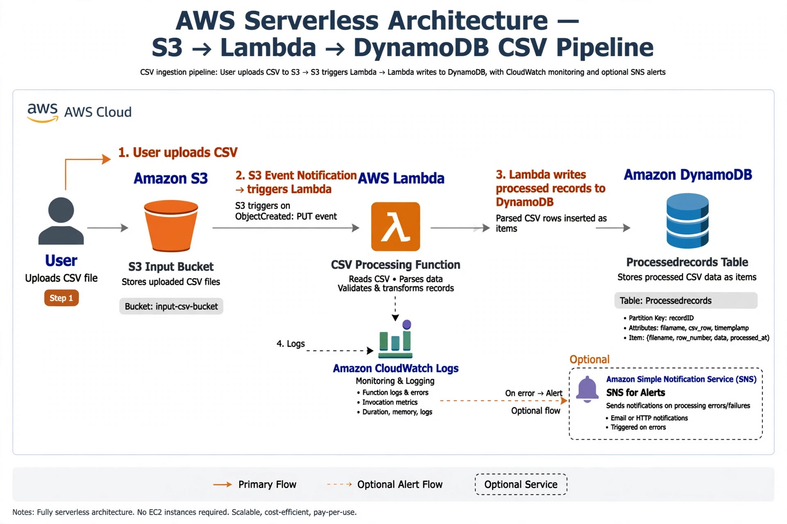

# AWS Serverless CSV Processing Pipeline - S3 → Lambda → DynamoDB

> Event-driven, zero-server project built in Pune - Upload CSV to S3, auto-process via Lambda, store in DynamoDB.


## 🚀 Live Demo Proof (What I Did)
- Uploaded `test.csv` to S3 Input Bucket
- S3 Event Notification triggered Lambda `csv-processor-pune`
- CloudWatch Logs: `File mili: test.csv` → `Done`
- DynamoDB Table `Processedrecords` - 2 items inserted
- Account: `320042237934` | Region: `us-east-1` (also tested in `ap-south-1` Mumbai)

## 🏗️ Architecture

**Flow:** `User → S3 Input Bucket → S3 Event (PUT) → Lambda → DynamoDB + CloudWatch Logs (Optional SNS)`

### Why 2 Buckets Concept? (Interview Question)
We used **1 bucket for MVP**. In production, 2-bucket pattern is used:
- **Bucket 1 (raw):** `csv-input-bucket` - receives files, triggers Lambda
- **Bucket 2 (processed):** `csv-processed-bucket` - Lambda moves file here after success to avoid re-trigger loop & for audit.
Our code currently only reads from Bucket 1 and writes to DynamoDB, so Bucket 2 is optional/archive.

## 📦 Resources Used 

| Resource | Name We Used | Purpose |
|----------|--------------|---------|
| **S3** | `csv-input-pune-*` | Store CSV, trigger Lambda on ObjectCreated |
| **Lambda** | `csv-processor-pune` (Python 3.9) | Parse CSV using `csv.DictReader`, PutItem to DynamoDB |
| **DynamoDB** | `Processedrecords` (Partition Key: `id` String) | Store each CSV row as item - case-sensitive! |
| **IAM Role** | `csv-processor-pune-role-ejfo7v83` | Give Lambda least-privilege access |
| **CloudWatch** | `/aws/lambda/csv-processor-pune` | Debugging - shows `AccessDenied`, `ResourceNotFoundException`, `Done` |

## 🛠️ Step-by-Step - How I Built It

1.  Create S3 bucket
2.  Create DynamoDB table `Processedrecords` with `id` as PK
3.  Create IAM Role for Lambda
4.  Create Lambda function, paste code from `lambda_function.py`
5.  Add S3 Trigger in Lambda: Event Type `All object create events`, Suffix `.csv`
6.  Upload `sample.csv`
7.  Check CloudWatch Logs - Should show `Done`
8.  Check DynamoDB -> Explore items -> 2 rows visible

### Errors I Faced & Fixed 
- **AccessDenied:** IAM role had no S3 permission -> Added `s3:GetObject`
- **ResourceNotFoundException: Cannot do operations on a non-existent table:** Code had `ProcessedRecords` (capital R) but table was `Processedrecords` (small r) -> DynamoDB is case-sensitive, fixed name.

## 🔐 IAM - Least Privilege (Final Policy)

Initially used `AmazonS3FullAccess` + `AmazonDynamoDBFullAccess` for testing. Then replaced with this minimal policy (what you should push to GitHub):

```json
{
    "Version": "2012-10-17",
    "Statement": [
        {
            "Effect": "Allow",
            "Action": "s3:GetObject",
            "Resource": "arn:aws:s3:::*/*"
        },
        {
            "Effect": "Allow",
            "Action": "dynamodb:PutItem",
            "Resource": "arn:aws:dynamodb:us-east-1:320042237934:table/Processedrecords"
        },
        {
            "Effect": "Allow",
            "Action": ["logs:CreateLogGroup","logs:CreateLogStream","logs:PutLogEvents"],
            "Resource": "arn:aws:logs:us-east-1:320042237934:*"
        }
    ]
}
```
This proves you follow security best practices.

## 💻 Code

See `lambda_function.py` - 20 lines event-driven code.

## 📸 Screenshots to Add in `/screenshots` folder

1.  `s3-bucket.png` - Your S3 bucket with test.csv
2.  `lambda-trigger.png` - Lambda S3 trigger config
3.  `cloudwatch-done.png` - Your screenshot showing `File mili: test.csv` and `Done` 
4.  `dynamodb-items.png` - DynamoDB Explore items showing 2 rows
5.  `iam-least-privilege.png` - IAM inline policy JSON


> "I built a serverless event-driven pipeline where uploading a CSV to S3 automatically triggers a Python Lambda which parses it and stores records in DynamoDB. I implemented least-privilege IAM, handled case-sensitive DynamoDB errors, and verified via CloudWatch logs. It's fully serverless, zero-cost when idle, and scales automatically."

## 🧹 Cleanup (To avoid billing)
```
Delete S3 objects -> Delete buckets -> Delete DynamoDB table -> Delete Lambda -> Delete IAM Role -> Delete CloudWatch Log Group
```


---
Built by Shubham | Pune | Account 320042237934
